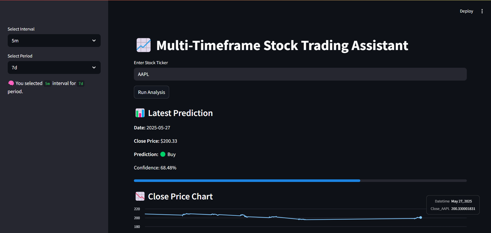
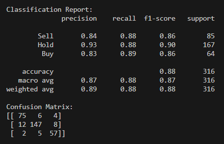

# 📈 Multi-Timeframe Stock Trading Assistant

An intelligent trading assistant powered by machine learning and technical indicators.  
It predicts Buy / Hold / Sell signals using multi-timeframe stock data, and displays results in a real-time, interactive **Streamlit** dashboard.

> 🔧 Built to showcase ML, data engineering, and frontend skills for fintech roles.

---

## 🚀 Features

- 🔍 **Real-time signal prediction** using technical indicators
- 🧠 **XGBoost model** trained on engineered features with SMOTE oversampling
- 🏷️ **Profitability-aware signal labeling** (TP/SL based)
- ⏱️ **Multi-timeframe support** (1m, 5m, 1d intervals)
- 📉 Interactive chart with predictions and confidence
- 💻 Lightweight frontend built with Streamlit
- ✅ High-performance metrics: 88% accuracy with balanced F1-scores

---

## 🖼️ Screenshots

### 📊 Prediction Output


### 🧠 Classification Report


---

## 🛠 Tech Stack

| Component      | Tools Used |
|----------------|------------|
| Language       | Python 3.10+ |
| ML Model       | XGBoost, SMOTE, scikit-learn |
| Data Sourcing  | yfinance API |
| Indicators     | `ta` (technical analysis library) |
| UI / Dashboard | Streamlit |
| Others         | pandas, joblib, imbalanced-learn |

---

## 📦 Installation

```bash
# 1. Clone the repo
git clone https://github.com/your-username/multi-timeframe-stock-trading-assistant.git
cd multi-timeframe-stock-trading-assistant

# 2. Install dependencies
pip install -r requirements.txt

# 3. Run the app
streamlit run app.py
